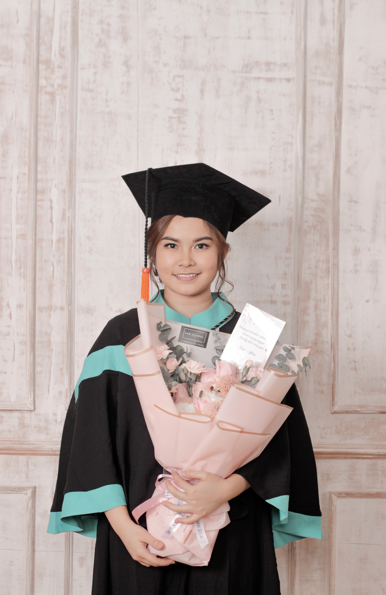

# About Me
## My name is Jesica Wirianti Budiman. I was born in Bandung, October 27, 1997. I got my bachelor degree from Parahyangan University, Indonesia majored in Chemical Engineering. After I graduated, I worked as a production staff in gold jewelry manufacture company in Indonesia. One year later, I decided to take master degree in Taiwan. So, here I am taking master in Tunghai University majoring Global Master Business Administration.

# Education
- BPK Penabur 1 Senior High School 

  2013-2016
- Parahyangan University 

  Majored : Chemical Engineering
  2016-2021
- Tunghai University
 
  Majored : GMBA
  2022-now
